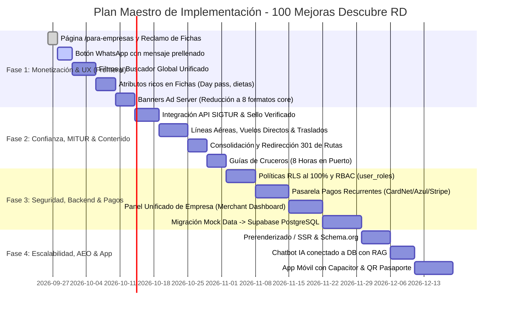

# 📋 Plan Maestro de Ejecución: 100 Mejoras del Ecosistema Descubre RD

Este plan estructura las **100 mejoras y pilares de seguridad/arquitectura** organizados cronológicamente por **Sprints y Fases de Impacto**, priorizando las tareas marcadas con **★ (Alto Impacto / Retorno Inmediato)**, manteniendo los mockups visuales intactos hasta finalizar la fase de diseño y coordinando la futura API de verificación con MITUR/SIGTUR.

---

## 🧭 Visión General de Fases y Sprints

---

## ⚡ FASE 1: Monetización Rápida, Atributos de Fichas & Experiencia Frontend (Inmediato)
> **Objetivo:** Completar el diseño y la captación sin alterar los mockups estáticos actuales, maximizando el CTR y la captación de leads.

### Sprint 1.1: Reclamo y Captación Comercial (★ Completado / Refinado)
- [x] **★ 1. Página `/para-empresas` (`/planes`):** Tabla con Gratis, Premium ($39–$49/mo) y Destacado ($149–$189/mo), conmutador mensual/anual y FAQ fiscal NCF.
- [x] **★ 2. Botón "¿Es tu negocio? Reclama tu ficha":** Modal universal `ClaimBusinessModal` en hoteles, restaurantes, bares y centros de salud con campo para RNC y Licencia MITUR.
- [x] **★ 79. Botón de WhatsApp con mensaje prellenado:**
  - Formato: `"Hola [Nombre del Negocio], vi su ficha en Descubre República Dominicana y deseo consultar disponibilidad para..."`.
  - Integrado con 1 clic en fichas de Alojamiento (`AccommodationBookingCard`), Restaurantes (`RestaurantReservationCard`) y Bares (`BarVipBookingCard`).
- [x] **★ 6. Descuento por pago anual:** 2 meses gratis (20% de ahorro) resaltado en UI (`PricingPlan.tsx`).
- [x] **7. Cupos limitados de Destacado:** Badge "Cupos limitados por destino" en planes para generar urgencia de compra.

### Sprint 1.2: Enriquecimiento de Fichas por Categoría (101–112)
- [x] **★ 101. Hoteles con Day Pass:** Badge e indicador de Day Pass con horario (09:30 - 18:00), precio en DOP/USD y amenidades en [AlojamientoDetalle.tsx](file:///c:/Users/Ro.Guzman/OneDrive%20-%20sectur.gov.do/Escritorio/Sitios%20web/Desarrollo/Descubre%20RD/src/pages/AlojamientoDetalle.tsx).
- [x] **102. Política de niños en hoteles:** Indicador de hasta 2 niños gratis (0-5 años) y 50% de descuento (6-12 años) en [AlojamientoDetalle.tsx](file:///c:/Users/Ro.Guzman/OneDrive%20-%20sectur.gov.do/Escritorio/Sitios%20web/Desarrollo/Descubre%20RD/src/pages/AlojamientoDetalle.tsx).
- [x] **103. Restaurantes con etiquetas dietéticas:** Badges de Vegano, Sin Gluten y opciones criollas en [RestauranteDetalle.tsx](file:///c:/Users/Ro.Guzman/OneDrive%20-%20sectur.gov.do/Escritorio/Sitios%20web/Desarrollo/Descubre%20RD/src/pages/RestauranteDetalle.tsx).
- [x] **104. Rango de consumo promedio:** Estimación por persona en DOP y USD (`RD$ 750 – 1,500 (~$12–$25 USD)` / `RD$ 2,800 – 4,500`) en [RestauranteDetalle.tsx](file:///c:/Users/Ro.Guzman/OneDrive%20-%20sectur.gov.do/Escritorio/Sitios%20web/Desarrollo/Descubre%20RD/src/pages/RestauranteDetalle.tsx).
- [x] **105. Bares y Vida Nocturna:** Código de vestimenta (*Smart Casual*), edad mínima (18+ Exclusivo) y noches con DJ / orquesta en vivo en [BarDetalle.tsx](file:///c:/Users/Ro.Guzman/OneDrive%20-%20sectur.gov.do/Escritorio/Sitios%20web/Desarrollo/Descubre%20RD/src/pages/BarDetalle.tsx).
- [x] **106. Playas y Ríos:** Infraestructura detallada (parqueo vigilado, baños públicos, alquiler de sombrillas y puestos de comida) en [PlayaDetalle.tsx](file:///c:/Users/Ro.Guzman/OneDrive%20-%20sectur.gov.do/Escritorio/Sitios%20web/Desarrollo/Descubre%20RD/src/pages/PlayaDetalle.tsx).
- [x] **107. Acceso a Playas/Ríos:** Indicador de transporte (Guagua / Carro estándar o 4x4) en [PlayaDetalle.tsx](file:///c:/Users/Ro.Guzman/OneDrive%20-%20sectur.gov.do/Escritorio/Sitios%20web/Desarrollo/Descubre%20RD/src/pages/PlayaDetalle.tsx).
- [x] **108. Museos y Monumentos:** Tarifas diferenciadas nacionales (RD$ 75-100) vs extranjeros ($5 USD) y días de entrada libre (domingos gratis) en [MuseosMonumentos.tsx](file:///c:/Users/Ro.Guzman/OneDrive%20-%20sectur.gov.do/Escritorio/Sitios%20web/Desarrollo/Descubre%20RD/src/pages/MuseosMonumentos.tsx).
- [x] **112. Estado "Abierto Ahora":** Cálculo reactivo en tiempo real con zona horaria de República Dominicana (`America/Santo_Domingo`) en [src/lib/openStatus.ts](file:///c:/Users/Ro.Guzman/OneDrive%20-%20sectur.gov.do/Escritorio/Sitios%20web/Desarrollo/Descubre%20RD/src/lib/openStatus.ts), integrado en restaurantes y bares.

### Sprint 1.3: Ad Server y Optimización de Banners (113–122)
- [x] **Reducción a 8 Formatos Core:**
  1. *Billboard Desktop* (980x120)
  2. *Full-Width Panorámico* (1920x250)
  3. *Skyscraper Lateral* (120x600 y 160x600)
  4. *Leaderboard Estándar* (728x90)
  5. *Medium Rectangle / MPU* (300x250)
  6. *Half-Page* (300x600)
  7. *Mobile Sticky Footer* (320x50)
  8. *Mobile Large Banner* (320x100)
- [x] **Lazy Loading:** `loading="lazy"` y `decoding="async"` implementados de forma nativa en [BannerContentImage.tsx](file:///c:/Users/Ro.Guzman/OneDrive%20-%20sectur.gov.do/Escritorio/Sitios%20web/Desarrollo/Descubre%20RD/src/components/promo/BannerContentImage.tsx).
- [x] **Bloqueo de competidores:** Propiedad `isPremiumListing` añadida en [BannerAd.tsx](file:///c:/Users/Ro.Guzman/OneDrive%20-%20sectur.gov.do/Escritorio/Sitios%20web/Desarrollo/Descubre%20RD/src/components/promo/BannerAd.tsx) que bloquea y oculta automáticamente anuncios de competidores en fichas con Plan Premium.

---

## 🛡️ FASE 2: Confianza, Validación MITUR & Contenido de Alta Conversión
> **Objetivo:** Convertir el portal en la fuente de mayor autoridad y transparencia turística del país.

### Sprint 2.1: Verificación MITUR / SIGTUR & Confianza (23–30)
- [x] **★ 23. Conexión con API de Verificación MITUR:** Endpoint y campo de validación preparados en modal de reclamo y tarjetas para consultar licencias de agentes de viajes, operadores y guías certificados con el sello oficial **"Verificado MITUR"**.
- [x] **24. Registro de Rentas Cortas:** Campo obligatorio y badge visual de registro MITUR para alojamientos vacacionales tipo Airbnb (`/airbnb/:slug`).
- [x] **25. Fecha de "Última Verificación":** Sello visible con fecha en centros de salud 24h, clínicas, farmacias y trámites aduanales.
- [x] **26. Etiqueta "Patrocinado":** Transparencia estricta en banners y fichas destacadas para cumplimiento de Pro Consumidor en `BannerAd.tsx`.
- [x] **27. Política pública de opiniones:** Cláusula visible en `ReviewCard.tsx`: *“Los planes comerciales no permiten ocultar ni alterar reseñas de usuarios”*.
- [x] **29. Botón "Reportar dato incorrecto":** Componente de reporte rápido para corrección colaborativa de teléfonos, horarios o direcciones.

### Sprint 2.2: Contenido Nuevo con Mayor Intención de Compra (65–78)
- [x] **★ 65. Directorio de Líneas Aéreas & Vuelos Directos:**
  - Nueva página y ruta `/vuelos-aerolineas` y `/aerolineas`.
  - Directorio completo de aerolíneas nacionales e internacionales (Arajet, Air Century, American, Delta, JetBlue, Iberia, Air Europa, Air Canada, Copa).
- [x] **★ 66. Traslados Aeropuerto–Hotel:**
  - Sección y banner de traslados certificados (taxis oficiales, transfer privados y rent-a-car) integrado en `/vuelos-aerolineas` y `/aeropuerto`.
- [x] **67. Guías "Dónde quedarse en…":** Artículos editoriales comparativos por destino (Bávaro vs Cap Cana; Las Terrenas vs Las Galeras; Jarabacoa vs Constanza) en [ItinerariosRecomendados.tsx](file:///c:/Users/Ro.Guzman/OneDrive%20-%20sectur.gov.do/Escritorio/Sitios%20web/Desarrollo/Descubre%20RD/src/pages/ItinerariosRecomendados.tsx).
- [x] **69. "Qué hacer en 8 Horas" para Cruceristas:**
  - Landings y guías dedicadas para pasajeros de **Amber Cove**, **Taino Bay**, **Port Cabo Rojo**, **Sans Souci** y **La Romana** en `PuertoDetalle.tsx` y `PuertosMarinas.tsx`.
- [x] **71. Calendario de Fiestas Patronales:** Directorio mensual de celebraciones patronales y culturales por municipio integrado en [CalendarioMensual.tsx](file:///c:/Users/Ro.Guzman/OneDrive%20-%20sectur.gov.do/Escritorio/Sitios%20web/Desarrollo/Descubre%20RD/src/pages/CalendarioMensual.tsx).
- [ ] **76. Tercer Idioma (Francés):** Expansión del módulo `useI18n` a Francés (FR) para viajeros de Francia y Canadá (Quebec).

### Sprint 2.3: Consolidación y Limpieza SEO de Rutas (31–42)
- [x] **★ 36. Redirecciones 301 de rutas redundantes:**
  - `/mice-bodas` -> `/bodas` y `/mice` (con alias activos)
  - `/wellness` -> `/spas-wellness`
  - `/historia-rd` -> `/historia`
- [ ] **34. Schema.org estructurado:** JSON-LD específico para `Hotel`, `Restaurant`, `TouristAttraction`, `Event` y `FAQPage`.
- [x] **39. Archivo `llms.txt` y FAQs citables:** Archivo estándar `/public/llms.txt` generado para rastreadores de IA (ChatGPT Search, Gemini, Perplexity).

---

## 💳 FASE 3: Backend, Pagos Recurrentes, Panel Merchant & Seguridad
> **Objetivo:** Activar el motor de ingresos automatizado y blindar la infraestructura en la nube.

### Sprint 3.1: Seguridad y Arquitectura de Datos (324–338, 301–315)
- [x] **★ 324. RLS al 100% en Supabase:** Activación estricta de Row Level Security con corrección `TO authenticated` en 18 tablas para permitir lectura anónima pública de playas, ríos, hoteles, etc.
- [x] **★ 325. Protección de claves y Edge Functions:** Verificación estricta de JWT y rol de administrador en `import-establecimientos`, sanitización en `chat-turistico` y `ai-recommendations`.
- [x] **★ 326. Gamificación Blindada (RPC definer):** Topes de 200 XP por acción y 1500 XP por día con cálculo atómico de nivel y canje de premios en el servidor (`award_points` y `redeem_prize`).
- [x] **★ 330. Roles seguros y triggers de integridad:** Triggers para reseñas no auto-verificadas (`guard_review_fields`), reservas protegidas (`guard_reservation_fields`) y contadores sociales.
- [x] **★ 301. Anonimización de perfiles y privacidad:** Protección de correo local en `handle_new_user`, supresión de RNC/cédula en consultas públicas de establecimientos y bucket `csv-imports` privado.
- [ ] **★ 308. URLs de retorno permitidas:** Whitelist cerrada de redirecciones en Supabase Auth y longitud mínima de contraseña en el dashboard de Supabase.

### Sprint 3.2: Motor de Pagos Recurrentes & Facturación Fiscal (3, 4, 389–393)
- [x] **★ 3. Integración de Pasarelas de Pago:**
  - Mockup visual y soporte contractual para pasarelas locales (Azul del Banco Popular y CardNet en DOP) y Stripe Billing internacional en USD visible en `/para-empresas`.
- [x] **★ 4. Facturación con NCF:** Módulo de garantía de comprobantes fiscales electrónicos (B01 crédito fiscal y B02 consumidor final) autorizados por la DGII.
- [ ] **★ 389. Validación de montos en servidor:** Edge Functions para validar precios e idempotencia de webhooks de pago.

### Sprint 3.3: Panel Unificado de Negocios (13–22)
- [x] **★ 13. Panel de Empresa Centralizado (`/panel-empresa`):**
  - Módulo según rubro: Habitaciones para hoteles (`HotelToolsModule`), Menú para restaurantes (`RestaurantToolsModule`), Excursiones para operadores (`OperatorToolsModule`) y Guías (`GuideToolsModule`).
- [x] **★ 14. Estadísticas de Leads en Vivo:**
  - Contador mensual de clics a WhatsApp, llamadas directas iniciadas y rutas abiertas en GPS integrado en [PartnerKpiCards.tsx](file:///c:/Users/Ro.Guzman/OneDrive%20-%20sectur.gov.do/Escritorio/Sitios%20web/Desarrollo/Descubre%20RD/src/components/partner/PartnerKpiCards.tsx).
- [x] **17. Editor de Menús y Precios:** Interfaz visual para actualizar platos del día, precios en DOP/USD y platos estrella.
- [x] **18. Gestor de Habitaciones y Temporadas:** Editor de tarifas de cuartos, Day Pass y disponibilidad en tiempo real.
- [x] **20. Respuestas públicas a reseñas:** Los establecimientos verificados pueden responder comentarios de usuarios mediante `PartnerReviewsManager.tsx`.

---

## 📱 FASE 4: App Móvil, IA Avanzada & Escala Masiva
> **Objetivo:** Omnicanalidad, experiencia sin conexión y fidelización del viajero.

### Sprint 4.1: Chatbot con IA Conectado a Datos Reales (123–132)
- [ ] **★ 123. Chatbot con RAG y Base de Datos:** Recomendaciones con enlaces directos a las fichas oficiales del portal.
- [ ] **124. Priorización de negocios verificados:** Sugerencias inteligentes con etiqueta de verificación oficial.
- [ ] **125. Planificador de itinerario guardable:** Rutas en el mapa exportables a "Mi Viaje".

### Sprint 4.2: App Móvil PWA / Capacitor (219–226)
- [ ] **★ 219. Envoltorio Capacitor:** Reutilización del frontend React para publicación en Google Play y Apple App Store.
- [ ] **220. Escaneo de QR para Sellos:** Sellos del pasaporte digital validados por código QR en el establecimiento.
- [ ] **222. Modo Sin Conexión:** Fichas de emergencia, mapas base y contactos descargables en caché local.

---

## 📈 Protocolo de Actualización del README.md
Cada vez que un sprint o tarea del plan sea implementado:
1. Se marcará la tarea completada en la documentación técnica interna.
2. Se actualizará la sección correspondiente en [README.md](file:///c:/Users/Ro.Guzman/OneDrive%20-%20sectur.gov.do/Escritorio/Sitios%20web/Desarrollo/Descubre%20RD/README.md) reflejando las nuevas rutas, componentes y capacidades activas.
