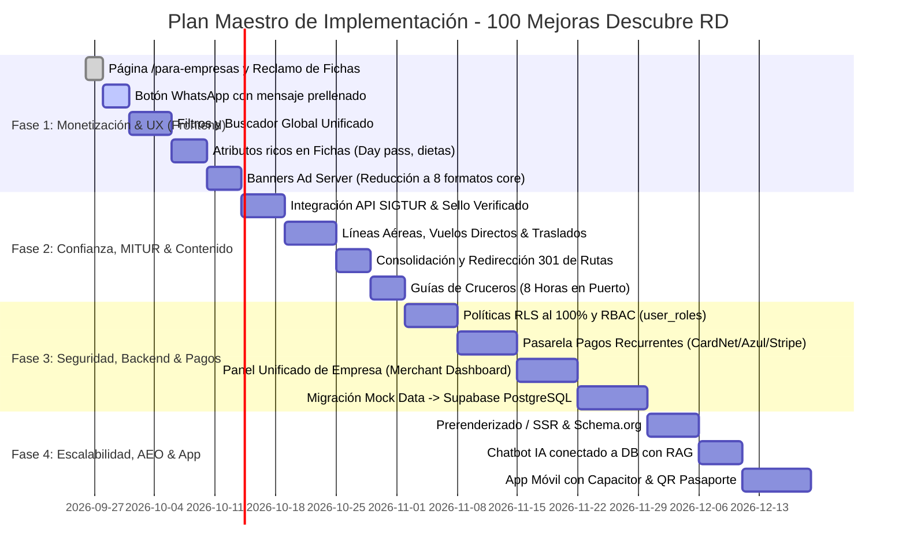

# 📋 Plan Maestro de Ejecución: 100 Mejoras del Ecosistema Descubre RD

Este plan estructura las **100 mejoras y pilares de seguridad/arquitectura** organizados cronológicamente por **Sprints y Fases de Impacto**, priorizando las tareas marcadas con **★ (Alto Impacto / Retorno Inmediato)**, manteniendo los mockups visuales intactos hasta finalizar la fase de diseño y coordinando la futura API de verificación con MITUR/SIGTUR.

---

## 🧭 Visión General de Fases y Sprints

---

## ⚡ FASE 1: Monetización Rápida, Atributos de Fichas & Experiencia Frontend (Inmediato)
> **Objetivo:** Completar el diseño y la captación sin alterar los mockups estáticos actuales, maximizando el CTR y la captación de leads.

### Sprint 1.1: Reclamo y Captación Comercial (★ Completado / Refinado)
- [x] **★ 1. Página `/para-empresas` (`/planes`):** Tabla con Gratis, Premium ($39–$49/mo) y Destacado ($149–$189/mo), conmutador mensual/anual y FAQ fiscal NCF.
- [x] **★ 2. Botón "¿Es tu negocio? Reclama tu ficha":** Modal universal `ClaimBusinessModal` en hoteles, restaurantes, bares y centros de salud con campo para RNC y Licencia MITUR.
- [x] **★ 79. Botón de WhatsApp con mensaje prellenado:**
  - Formato: `"Hola [Nombre del Negocio], vi su ficha en Descubre República Dominicana y deseo consultar disponibilidad para..."`.
  - Integrado con 1 clic en fichas de Alojamiento (`AccommodationBookingCard`), Restaurantes (`RestaurantReservationCard`) y Bares (`BarVipBookingCard`).
- [x] **★ 6. Descuento por pago anual:** 2 meses gratis (20% de ahorro) resaltado en UI (`PricingPlan.tsx`).
- [x] **7. Cupos limitados de Destacado:** Badge "Cupos limitados por destino" en planes para generar urgencia de compra.

### Sprint 1.2: Enriquecimiento de Fichas por Categoría (101–112)
- [ ] **★ 101. Hoteles con Day Pass:** Badge e indicador de Day Pass con horario, precio en DOP/USD y amenidades incluidas.
- [ ] **102. Política de niños en hoteles:** Edades gratis y tarifas reducidas en fichas.
- [ ] **103. Restaurantes con etiquetas dietéticas:** Iconos de Vegano, Sin Gluten (Celiaco), Apto Keto, Mariscos frescos y Picante criollo.
- [ ] **104. Rango de consumo promedio:** Estimación por persona en DOP y USD (ej. `RD$ 850 – 1,500 (~$15–$25 USD)`).
- [ ] **105. Bares y Vida Nocturna:** Código de vestimenta (*Dress code*), edad mínima (+18 / +21) y noches con DJ / orquesta en vivo.
- [ ] **106. Playas y Ríos:** Infraestructura detallada (parqueo vigilado, baños públicos, alquiler de sombrillas, salvavidas y puestos de comida).
- [ ] **107. Acceso a Playas/Ríos:** Indicador de accesibilidad: *Vehículo 4x4*, *Carro estándar*, *Transporte público / Guagua*, o *Sendero a pie*.
- [ ] **108. Museos y Monumentos:** Horarios, tarifas diferenciadas para dominicanos y extranjeros, y días de entrada libre.
- [ ] **112. Estado "Abierto Ahora":** Cálculo reactivo en tiempo real con zona horaria de República Dominicana (`America/Santo_Domingo`).

### Sprint 1.3: Ad Server y Optimización de Banners (113–122)
- [ ] **Reducción a 8 Formatos Core:**
  1. *Billboard Desktop* (980x120)
  2. *Full-Width Panorámico* (1920x250)
  3. *Skyscraper Lateral* (120x600 y 160x600)
  4. *Leaderboard Estándar* (728x90)
  5. *Medium Rectangle / MPU* (300x250)
  6. *Half-Page* (300x600)
  7. *Mobile Sticky Footer* (320x50)
  8. *Mobile Large Banner* (320x100)
- [ ] **Lazy Loading:** `loading="lazy"` obligatorio en banners para proteger el Core Web Vitals (LCP/CLS).
- [ ] **Bloqueo de competidores:** Las fichas con Plan Premium desactivan automáticamente banners de competidores del mismo rubro.

---

## 🛡️ FASE 2: Confianza, Validación MITUR & Contenido de Alta Conversión
> **Objetivo:** Convertir el portal en la fuente de mayor autoridad y transparencia turística del país.

### Sprint 2.1: Verificación MITUR / SIGTUR & Confianza (23–30)
- [ ] **★ 23. Conexión con API de Verificación MITUR:** Endpoint preparado para consultar licencias de agentes de viajes, operadores y guías certificados con el sello oficial **"Verificado MITUR"**.
- [ ] **24. Registro de Rentas Cortas:** Campo obligatorio de código MITUR para alojamientos tipo Airbnb (`/airbnb/:id`).
- [ ] **25. Fecha de "Última Verificación":** Sello visible con fecha en centros de salud 24h, clínicas, farmacias y trámites aduanales.
- [ ] **26. Etiqueta "Patrocinado":** Transparencia estricta en banners y fichas destacadas para cumplimiento de Pro Consumidor.
- [ ] **27. Política pública de opiniones:** Cláusula visible: *“Los planes comerciales no permiten ocultar ni alterar reseñas de usuarios”*.
- [ ] **29. Botón "Reportar dato incorrecto":** Modal ligero en cada ficha para corrección colaborativa de teléfonos, horarios o direcciones.

### Sprint 2.2: Contenido Nuevo con Mayor Intención de Compra (65–78)
- [ ] **★ 65. Directorio de Líneas Aéreas & Vuelos Directos:**
  - Nueva ruta `/vuelos-aerolineas` y `/aerolinea/:id`.
  - Respuestas a: *"¿Qué aerolíneas vuelan directo a Punta Cana / Santo Domingo desde tu país?"*.
- [ ] **★ 66. Traslados Aeropuerto–Hotel:**
  - Nueva sección de traslados certificados (taxis turísticos, shuttles compartidos y transporte privado VIP).
- [ ] **67. Guías "Dónde quedarse en…":** Artículos editoriales comparativos por destino (ej. Bávaro vs Cap Cana; Las Terrenas vs Las Galeras).
- [ ] **69. "Qué hacer en 8 Horas" para Cruceristas:**
  - Landings dedicadas para pasajeros de **Amber Cove**, **Taino Bay**, **Port Cabo Rojo** y **La Romana Cruise Terminal**.
- [ ] **71. Calendario de Fiestas Patronales:** Directorio mensual de celebraciones patronales y culturales por municipio.
- [ ] **76. Tercer Idioma (Francés):** Expansión del módulo `useI18n` a Francés (FR) para viajeros de Francia y Canadá (Quebec).

### Sprint 2.3: Consolidación y Limpieza SEO de Rutas (31–42)
- [ ] **★ 36. Redirecciones 301 de rutas redundantes:**
  - `/mice-bodas` -> `/bodas`
  - `/wellness` -> `/spas-wellness`
  - `/historia-rd` -> `/historia`
  - `/gamificacion-turistica` -> `/pasaporte-digital`
  - `/explorer-profile` -> `/perfil-jugador`
  - `/agencias` -> `/operadores/directorio`
- [ ] **34. Schema.org estructurado:** JSON-LD específico para `Hotel`, `Restaurant`, `TouristAttraction`, `Event` y `FAQPage`.
- [ ] **39. Archivo `llms.txt` y FAQs citables:** Preparación para motores de búsqueda de IA (ChatGPT Search, Gemini, Perplexity).

---

## 💳 FASE 3: Backend, Pagos Recurrentes, Panel Merchant & Seguridad
> **Objetivo:** Activar el motor de ingresos automatizado y blindar la infraestructura en la nube.

### Sprint 3.1: Seguridad y Arquitectura de Datos (324–338, 301–315)
- [ ] **★ 324. RLS al 100% en Supabase:** Activación estricta de Row Level Security en todas las tablas públicas.
- [ ] **★ 325. Protección de claves:** Confirmar que `service_role` jamás se incluya en el frontend ni en variables `VITE_`.
- [ ] **★ 330. Roles seguros en tabla separada:** Implementar tabla `user_roles` con función `has_role()` `security definer`.
- [ ] **★ 301. Errores genéricos en autenticación:** Mensajes neutrales en login y reset para evitar enumeración de correos.
- [ ] **★ 308. URLs de retorno permitidas:** Whitelist cerrada de redirecciones en Supabase Auth.
- [ ] **364. Storage seguro:** Buckets de fotos con validación MIME, límites de tamaño y sin ejecución de scripts SVG.

### Sprint 3.2: Motor de Pagos Recurrentes & Facturación Fiscal (3, 4, 389–393)
- [ ] **★ 3. Integración de Pasarelas de Pago:**
  - Pasarela local (CardNet o Azul) para suscripciones en pesos dominicanos (DOP).
  - Stripe Billing para tarjetas internacionales en USD.
- [ ] **★ 4. Facturación con NCF:** Generación de comprobantes fiscales (B01 y B02) con descarga de PDF desde el panel del cliente.
- [ ] **★ 389. Validación de montos en servidor:** Edge Functions para validar precios e idempotencia de webhooks de pago.

### Sprint 3.3: Panel Unificado de Negocios (13–22)
- [ ] **★ 13. Panel de Empresa Centralizado (`/panel-empresa`):**
  - Módulo según rubro: Habitaciones para hoteles, Menú para restaurantes, Excursiones para operadores.
- [ ] **★ 14. Estadísticas de Leads en Vivo:**
  - Contador mensual de clics a WhatsApp, llamadas iniciadas, rutas abiertas en GPS y formularios recibidos.
- [ ] **17. Editor de Menús y Precios:** Interfaz visual para actualizar platos del día y precios.
- [ ] **18. Gestor de Habitaciones y Temporadas:** Editor de fotos de cuartos y tarifas de referencia.
- [ ] **20. Respuestas públicas a reseñas:** Los establecimientos verificados pueden responder comentarios de usuarios.

---

## 📱 FASE 4: App Móvil, IA Avanzada & Escala Masiva
> **Objetivo:** Omnicanalidad, experiencia sin conexión y fidelización del viajero.

### Sprint 4.1: Chatbot con IA Conectado a Datos Reales (123–132)
- [ ] **★ 123. Chatbot con RAG y Base de Datos:** Recomendaciones con enlaces directos a las fichas oficiales del portal.
- [ ] **124. Priorización de negocios verificados:** Sugerencias inteligentes con etiqueta de verificación oficial.
- [ ] **125. Planificador de itinerario guardable:** Rutas en el mapa exportables a "Mi Viaje".

### Sprint 4.2: App Móvil PWA / Capacitor (219–226)
- [ ] **★ 219. Envoltorio Capacitor:** Reutilización del frontend React para publicación en Google Play y Apple App Store.
- [ ] **220. Escaneo de QR para Sellos:** Sellos del pasaporte digital validados por código QR en el establecimiento.
- [ ] **222. Modo Sin Conexión:** Fichas de emergencia, mapas base y contactos descargables en caché local.

---

## 📈 Protocolo de Actualización del README.md
Cada vez que un sprint o tarea del plan sea implementado:
1. Se marcará la tarea completada en la documentación técnica interna.
2. Se actualizará la sección correspondiente en [README.md](file:///c:/Users/Ro.Guzman/OneDrive%20-%20sectur.gov.do/Escritorio/Sitios%20web/Desarrollo/Descubre%20RD/README.md) reflejando las nuevas rutas, componentes y capacidades activas.
