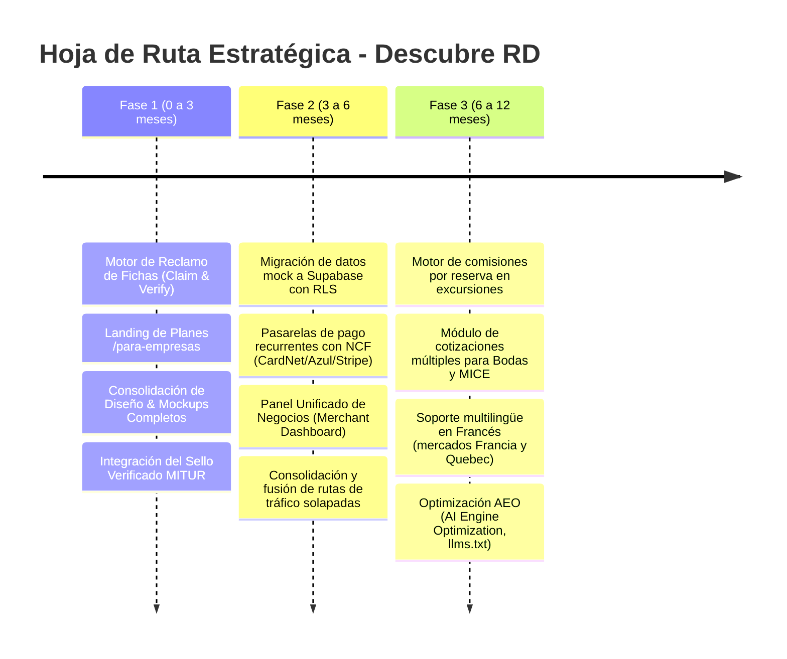

# 🇩🇴 Descubre República Dominicana — Portal Turístico Inteligente

Bienvenido al repositorio oficial de **Descubre República Dominicana**, la plataforma digital líder y ecosistema turístico inteligente diseñado para conectar a viajeros, turistas locales e internacionales con las maravillas culturales, gastronómicas, ecológicas y hoteleras de la República Dominicana.

---

## 🌟 Resumen del Ecosistema

El proyecto es una **Single Page Application (SPA)** de arquitectura moderna construida sobre **React 18**, **TypeScript**, **Vite** y **Tailwind CSS**, complementada con componentes accesibles de **Radix UI / shadcn/ui**, animaciones fluidas con **Framer Motion**, y backend en la nube con **Supabase** (autenticación, base de datos relacional PostgreSQL, RPC y Storage).

El portal incluye más de **240 páginas y módulos especializados**, abarcando:
1. **Directorio Turístico Exhaustivo:** Provincias (32 provincias y Distrito Nacional), destinos, municipios, playas, ríos, montañas, parques nacionales y áreas protegidas.
2. **Alojamientos & Reservas:** Hoteles, resorts todo incluido, eco-lodges, villas y apartamentos estilo Airbnb con páginas de detalle dedicadas y reservas directas con operadores.
3. **Red de Operadores Turísticos B2B (`src/modules/operadores`):** Vitrinas independientes (*storefronts*) por operador, catálogo de excursiones y panel de autogestión de tarifas y reservas.
4. **Tienda Oficial & Comercio Turístico (`src/modules/tienda`):** Souvenirs auténticos, artesanías criollas, café de altura y merchandising con carrito global y checkout.
5. **Gastronomía & Vida Nocturna:** Guía culinaria de sabores criollos, recetas dominicanas con cálculo de ingredientes, chefs galardonados, rutas del sabor y directorio de restaurantes y bares.
6. **Salud, Farmacias & Asistencia 24 Horas:** Fichas técnicas de hospitales, clínicas odontológicas, laboratorios y farmacias con geolocalización, seguros médicos / ARS aceptadas, idiomas del personal y llamadas de emergencia directas.
7. **Gamificación & Pasaporte Digital del Viajero:** Sistema de puntos XP, insignias coleccionables (*badges*), retos por provincia, trivia turística y recompensas.
8. **Herramientas para el Viajero & Chatbot IA:** Asistente virtual inteligente para consultas de viaje, calculadora de peajes, conversor de tasas de cambio oficial y comercial (USD/EUR/DOP), reporte de sargazo y oleaje, itinerarios generados por IA, lista de empaque inteligente y audioguías.
9. **Soporte Multilingüe (i18n):** Alternancia dinámica en tiempo real entre **Español (ES)** e **Inglés (EN)**.
10. **Motor Publicitario (Ad Server Propio):** Soporte de 32 formatos IAB e interactivos, incluyendo banners de pantalla completa (*Full-Width* 1920x250 y Retina 2x), rascacielos (*skyscrapers*), popups de abandono (*exit-intent*) y cinta flash superior (*TopBar*).
11. **Panel Administrativo Centralizado (`/admin`):** Gestión y moderación de contenido, analíticas en tiempo real (CTR, visualizaciones y clics), creador visual de rutas turísticas, consola de stock y moderación de contenido generado por usuarios (UGC).

---

## 🏗️ Arquitectura Técnica y Stack Tecnológico

| Capa / Módulo | Tecnologías Utilizadas |
| :--- | :--- |
| **Framework Base** | React 18 (Hooks, Suspense, Lazy Loading) |
| **Lenguaje** | TypeScript 5 (tipado estricto en datos y entidades) |
| **Bundler & Build Tool** | Vite |
| **Estilos & UI** | Tailwind CSS + Radix UI + shadcn/ui + Lucide Icons |
| **Animaciones** | Framer Motion |
| **Gestión de Estado & Cache** | TanStack Query (React Query v5) + Context API (`useAuth`, `useCart`, `useFavorites`, `useI18n`) |
| **Backend & Base de Datos** | Supabase Cloud (PostgreSQL, Row Level Security, Auth, RPC) |
| **SEO & Metadatos** | `react-helmet-async` (OpenGraph, Twitter Cards, Schema.org estructurado) |
| **Enrutamiento** | React Router v6 |
| **Mapas & Geolocalización** | Leaflet (`react-leaflet`) + `leaflet.markercluster` + Google Maps API |
| **Pruebas Automatizadas** | Vitest + Testing Library (`@testing-library/react`, `@testing-library/jest-dom`) |
| **Internacionalización** | Sistema nativo i18n extensible (Español / Inglés) |

---

## 📂 Estructura de Directorios

```text
├── public/
│   ├── banners/              # Catálogo de 32 imágenes oficiales de banners (Desktop, Mobile, Full-Width)
│   ├── placeholder.svg       # Fallbacks optimizados
│   └── favicon.ico
├── src/
│   ├── assets/               # Recursos estáticos, fotografías de destinos y texturas
│   ├── components/
│   │   ├── admin/            # Paneles del Admin (Dashboard, Analytics, UGC, Banners, NPS, Rutas)
│   │   ├── promo/            # Sistema Ad Server (BannerAd, Billboard, Skyscraper, FullWidthScreenAd)
│   │   ├── ui/               # Componentes del sistema de diseño (shadcn/ui + Tailwind)
│   │   ├── accommodation/    # Componentes de hoteles, servicios, habitaciones y menús
│   │   ├── destination/      # Secciones editoriales, zonas, galerías y clima de destinos
│   │   ├── forms/            # Formularios de contacto, cotizaciones y sorteos
│   │   ├── privacy/          # Banners de consentimiento de cookies y políticas
│   │   ├── ChatbotTuristico.tsx # Asistente conversacional inteligente flotante
│   │   └── Header.tsx / Footer.tsx
│   ├── data/                 # Bases de datos enriquecidas y catálogos locales
│   │   ├── officialBanners.ts# Catálogo de los 32 banners oficiales con dimensiones exactas
│   │   ├── healthCenters.ts  # Directorio nacional de centros de salud 24h
│   │   ├── hotelDetailData.ts# Fichas técnicas, amenidades y habitaciones de alojamientos
│   │   ├── restaurantDetailData.ts # Fichas de restaurantes, menús y precios
│   │   └── mockDestinations.ts, mockProvinces.ts, etc.
│   ├── hooks/                # Custom hooks (useAuth, useCart, useFavorites, useI18n, useAdBanners)
│   ├── integrations/         # Clientes de integración externa (Supabase)
│   ├── modules/
│   │   ├── operadores/       # Directorio B2B, vitrinas y panel de tour operadores
│   │   └── tienda/           # Tienda oficial de productos dominicanos, carrito y checkout
│   ├── pages/                # Más de 240 vistas y rutas de la aplicación
│   ├── lib/                  # Utilidades comunes (formateadores, cn, sanitización)
│   └── App.tsx               # Enrutador central y proveedores de contexto
```

---

## 🚀 Funcionalidades Principales

### 1. Directorio Turístico de Alta Fidelidad
- **32 Provincias & Regiones:** Fichas históricas, atractivos principales, gastronomía típica, galerías fotográficas y mapa interactivo.
- **Playas, Ríos y Montañas:** Información de oleaje, cómo llegar, nivel de acceso y recomendaciones de seguridad vial y ambiental.
- **Detalle de Parques Nacionales:** Rutas de senderismo, normativas del Ministerio de Medio Ambiente y fauna endémica.

### 2. Ecosistema de Alojamientos y Hoteles
- Fichas completas para resorts todo incluido, hoteles boutique y eco-alojamientos.
- Visualización de habitaciones por categoría, gastronomía interna, amenidades (piscinas, spas, deportes acuáticos) y políticas de cancelación.
- Comparador inteligente de hoteles y enlace a reservas directas.

### 3. Red de Operadores Turísticos (`src/modules/operadores`)
- **Directorio y Vitrina B2B:** Directorio certificado de tour operadores locales clasificados por región y especialidad.
- **Storefront Personalizado:** Cada operador cuenta con su propia página de catálogo (`OperadorStorefront`) y ficha de servicio (`OperadorServicio`).
- **Panel del Operador (`OperatorPanel`):** Consola privada donde los operadores configuran disponibilidades, precios, promociones y atienden solicitudes de reserva.

### 4. Tienda Oficial de Souvenirs & Artesanías (`src/modules/tienda`)
- Catálogo de productos auténticos dominicanos (café gourmet, artesanías taínas, larimar, gorras y textiles).
- Carrito de compras reactivo (`CartProvider`) persistente entre sesiones con flujo de checkout intuitivo.

### 5. Asistente Conversacional Inteligente & Chatbot Turístico
- Chatbot flotante accesible en todo el portal (`ChatbotTuristico.tsx`).
- Respuestas instantáneas sobre recomendaciones de itinerarios, gastronomía típica, requerimientos aduanales, vacunas y consejos para viajeros.

### 6. Salud, Clínicas & Emergencias 24h (`/salud-24h`)
- Buscador y filtrado por región (Norte, Sur, Este, Santo Domingo) y tipo de centro (hospitales, farmacias 24h, laboratorios, clínicas dentales).
- Tarjetas con fotografía panorámica, badges de certificación y pulso de atención 24 horas.
- Acceso directo a llamadas telefónicas de urgencia (`tel:`), botón directo para ruta en Google Maps y formulario de solicitud de citas para turistas bilingües.

### 7. Sistema Publicitario & Monetización (Ad Engine Propio)
El portal dispone de un sistema nativo para la comercialización de espacios publicitarios turísticos con soporte de 32 formatos estandarizados:
- **Pantalla Completa (*Full-Width Screen*):** Formatos de 1920 × 250 px (`FullWidthScreenAd` y `FullWidthScreenAd2x`) que se extienden al 100% del viewport.
- **Panorámicos & Cabeceras:** `Billboard` (980x120), `Large Leaderboard` (970x90), `Leaderboard Estándar` (728x90) y `Top Banner` (930x180).
- **Rascacielos (*Skyscrapers*):** `120x600`, `160x600 Wide Skyscraper`, `300x600 Half-Page` y `300x1050 Portrait` para barras laterales y secciones inmersivas (ej. sección de Bares en Inicio a 100vh).
- **Formatos Móviles:** `320x50 Leaderboard Móvil`, `320x100 Large Banner`, `320x480 Intersticial` y `MobileStickyFooterAd` con cierre opcional.
- **Rastreo Automático:** Medición en tiempo real de impresiones visibles y clics únicos por banner.

### 8. Gamificación & Pasaporte Digital
- Registro de sellos digitales por cada provincia o atractivo visitado.
- Perfil del explorador con acumulación de puntos de experiencia (XP), niveles turísticos y tablas de clasificación.
- Retos y trivias con recompensas aplicables en operadores locales.
- Notificaciones de logros en tiempo real con `GamificationToastOverlay`.

### 9. Panel Administrativo (`/admin`)
Acceso protegido por roles de Supabase (`has_role('admin')`) con interfaz anti-fatiga que incluye:
- **Dashboard & Analíticas:** Métricas de visitas, interacción y tasas de conversión.
- **Banners & Anuncios (`AdminMockupBanners`):** Simulador de campañas en vivo, control de modo (fijo o rotativo dinámico), asignación por página y catálogo visual con copia de rutas.
- **Gestión de Entidades:** Moderación de usuarios, operadores turísticos registrados y reservas directas.
- **Creador de Rutas & Itinerarios:** Interfaz visual para diseñar circuitos turísticos interprovinciales.
- **Moderación de Reseñas y Contenido (UGC):** Aprobación de fotos y comentarios de la comunidad.

---

## 🧭 Catálogo de Páginas y Módulos del Portal (Más de 240 Rutas)

El portal está estructurado en 12 áreas principales de navegación y módulos funcionales:

### 1. Territorio, Provincias y Destinos
- **Destinos Principales y Regiones:** `/destinos`, `/destinos/regiones`, `/destinos/region/:regionId`, `/destinos/categoria/:categoriaId`, `/destinos/:id` (Punta Cana, Santo Domingo, Samaná, Puerto Plata, Jarabacoa, Barahona, Montecristi, etc.).
- **32 Provincias & Municipios:** `/provincias`, `/provincias/:slug`, `/municipio/:slug` (cobertura total de provincias con datos históricos, municipios, atractivos y gastronomía local).
- **Playas y Ríos:** `/playas`, `/playa/:id`, `/rios`, `/rio/:id` (directorio hidrográfico con nivel de oleaje, tipo de arena, accesos, seguridad y mapas).
- **Montañas y Senderismo:** `/montanas`, `/montana/:id`, `/pico-duarte` (guías de alta montaña, altimetría, temperaturas medias y recomendaciones de senderismo).
- **Áreas Protegidas y Reservas:** `/areas-protegidas`, `/reservas-naturales`, `/parque-nacional/:id`, `/cueva/:id` (fauna endémica, cuevas taínas, normativas ecológicas y senderos).
- **Mapas y Georreferenciación:** `/mapa-interactivo`, `/mapas-tematicos`, `/mapa-misiones` (mapas con Leaflet, clusters y filtros por categoría).

### 2. Alojamientos, Hospitalidad & Bienestar
- **Hoteles y Resorts:** `/alojamientos`, `/alojamiento/:id` (resorts todo incluido, hoteles boutique y eco-lodges con fichas de habitaciones, amenidades y reservas).
- **Airbnb y Estancias Vacacionales:** `/airbnb/:id` (apartamentos, villas y chalets con normas, capacidad y fotos de alta resolución).
- **Comparador de Hoteles:** `/comparador-hoteles` (comparativa interactiva de características, tarifas estimadas y amenidades).
- **Spas, Retiros y Bienestar:** `/spas-wellness`, `/wellness`, `/spa/:id` (circuitos hidrotermales, masajes y centros de relajación).
- **Manantiales y Aguas Termales:** `/aguas-termales` (inventario hidrotermal con propiedades minerales y ubicación).

### 3. Gastronomía, Rutas del Sabor y Vida Nocturna
- **Guía Culinaria & Restaurantes:** `/guia-gastronomica`, `/restaurantes`, `/restaurante/:id` (fichas detalladas con cartas de menú, especialidades, rangos de precio y reservas).
- **Perfiles de Chefs Destacados:** `/chef/:id` (biografía culinaria, creaciones emblemáticas y restaurantes asociados).
- **Recetario Tradicional Dominicano:** `/recetas`, `/receta/:id` (ingredientes con calculadora interactiva de porciones, instrucciones paso a paso e historia del plato).
- **Identificador de Platos Típicos:** `/identificador-comida` (buscador inteligente y visual de platos tradicionales dominicanos).
- **Vida Nocturna y Bares:** `/vida-nocturna`, `/bar/:id`, `/bebidas-rd` (discotecas, lounges, coctelería tropical, mamajuana y rones con layout inmersivo a 100vh).
- **Rutas Agro-Gastronómicas:** `/rutas-sabor`, `/cultura-cafe`, `/cultura-tabaco`, `/ruta-ron-tabaco`, `/ruta-larimar`, `/suscripciones-sabores`.

### 4. Cultura, Historia, Tradiciones y Folclore
- **Monumentos y Museos:** `/patrimonio`, `/museos-monumentos`, `/cultura` (joyas de la Ciudad Colonial de Santo Domingo, fortalezas y museos).
- **Historia Dominicana:** `/historia`, `/historia/:slug`, `/historia-rd`, `/personaje-historico/:id`, `/evento-historico/:id` (línea cronológica desde la época prehispánica taína hasta la República contemporánea).
- **Historia Viva en Realidad Aumentada:** `/historia-viva-ar` (experiencia interactiva con reconstrucciones patrimoniales).
- **Carnaval & Ritmos Nacionales:** `/carnaval`, `/escuela-ritmos` (caretas tradicionales, personajes carnavalescos, merengue, bachata y son).
- **Turismo Religioso:** `/turismo-religioso`, `/destino-religioso/:id` (Basílica Catedral Nuestra Señora de la Altagracia, Santo Cerro e iglesias históricas).
- **Glosario e Idioma:** `/diccionario-dominicano`, `/espanol-viajero`, `/guia-etiqueta` (dominicanismos, modismos y normas de cortesía cultural).

### 5. Asistencia, Salud 24 Horas & Seguridad al Viajero
- **Salud y Clínicas 24 Horas:** `/salud-24h`, `/centro-salud/:id` (hospitales de trauma, clínicas turísticas, farmacias 24h, laboratorios y dentistas con ARS/seguros aceptados y botón de llamada de urgencia).
- **Seguridad y Contactos de Emergencia:** `/contactos-emergencia`, `/leyes-turista`, `/info-seguridad` (POLITUR, 911, asistencia vial de MOPC y marco legal para visitantes extranjeros).
- **Cuerpo Diplomático:** `/embajadas-consulados` (directorio de embajadas y consulados extranjeros en República Dominicana).
- **Asistencia Médica y Seguros:** `/seguro-viaje` (guía de pólizas de viaje y coberturas para repatriación o emergencias médicas).

### 6. Movilidad, Transporte, Puertos y Migración
- **Aeropuertos Internacionales:** `/aeropuerto`, `/aeropuerto/:id` (terminales de AILA, Punta Cana PUJ, Cibao STI, Puerto Plata POP, La Romana LRM, Samaná AZS, etc.).
- **Puertos de Cruceros y Marinas Deportivas:** `/puertos-marinas`, `/puerto/:id`, `/marina/:id`, `/nautica-cruceros` (Amber Cove, Taino Bay, Port Cabo Rojo, Marina Cap Cana, Casa de Campo Marina).
- **Transporte Masivo y Terrestre:** `/transporte-urbano`, `/metro-santo-domingo`, `/teleferico-santo-domingo`, `/monoriel-santiago`, `/info-transporte`, `/seguridad-vial`.
- **Renta de Vehículos:** `/alquiler-vehiculos` (flota, requisitos para extranjeros, cobertura de colisión y peajes).
- **Trámites de Entrada al País:** `/e-ticket`, `/requisitos-viaje`, `/aduanas-duty-free`, `/zonas-horarias`.

### 7. Herramientas Prácticas para el Viajero (Smart Travel Utilities)
- **Asistente Inteligente e Itinerarios con IA:** `/itinerario-ia`, `/planifica`, `/itinerarios-recomendados`, `/planificador-grupal`.
- **Calculadoras y Finanzas:**
  - Calculadora de Presupuesto de Viaje: `/calculadora-presupuesto`
  - Calculadora de Peajes: `/calculadora-peajes` (cálculo por tramos de autopistas dominicanas)
  - Precios de Combustibles: `/precios-combustible` (actualizaciones semanales oficiales)
  - Conversor de Divisas: `/conversor-moneda`, `/tasas-cambio` (tasa del Banco Central y divisas turísticas)
  - Calculadoras de Inversión y CONFOTUR: `/calculadora-tributaria`, `/calculadora-confotur` (incentivos fiscales ley 158-01)
  - Calculadora de Huella de Carbono: `/calculadora-carbono`
- **Condiciones Ambientales en Vivo:**
  - Observatorio de Sargazo: `/observatorio-sargazo` (monitoreo costero y estado de playas)
  - Reporte de Olas y Viento: `/reporte-olas-viento`, `/estado-playas`
  - Webcams en Directo: `/webcams`
  - Clima y Temporadas Turísticas: `/clima-temporadas`
- **Logística del Viajero:** `/lista-empaque`, `/check-in-digital`, `/conectividad`, `/esim-turista`, `/tarjeta-prepago`.
- **Inclusión y Accesibilidad:** `/audio-guias`, `/silent-guide` (guías accesibles para personas con discapacidad visual o auditiva), `/accesibilidad`.

### 8. Turismo de Nicho, Deportes y Segmentos
- **Viajeros con Necesidades Especiales:** `/viajera-sola`, `/familia-con-ninos`, `/viajeros-senior`, `/viajar-con-mascotas`, `/guia-lgbtq`, `/guia-vegana`, `/guia-halal-kosher`.
- **Deportes y Aventura:** `/turismo-deportivo`, `/golf-rd` (circuitos PGA Teeth of the Dog, Punta Espada, Corales), `/turismo-buceo`, `/avistamiento-aves`, `/astroturismo`, `/lidom` (béisbol invernal dominicano con estadios `/estadio/:id`).
- **Sostenibilidad y Comunidad:** `/sostenible`, `/turismo-comunitario`, `/volunturismo`, `/guardian-caribe`, `/vive-local`.
- **Eventos MICE, Bodas y Negocios:** `/mice`, `/bodas`, `/mice-bodas`, `/eventos-grupo`, `/turismo-medico`, `/clinica/:id`.
- **Nómadas Digitales e Inversión:** `/nomadas-digitales`, `/bienes-raices`, `/inversion`, `/proyectos-inversion`.

### 9. Gamificación & Pasaporte del Explorador
- **Pasaporte Digital & Hub:** `/pasaporte-digital`, `/gamificacion-hub`, `/gamificacion-turistica`.
- **Misiones & Desafíos:** `/retos-turisticos`, `/reto-top-100` (`Top100`), `/trivia-turistica`.
- **Perfil de Juego y Recompensas:** `/perfil-jugador`, `/explorer-profile`, `/mis-logros`, `/badges`, `/club-recompensas`, `/sorteos-premios`.

### 10. Red B2B de Operadores & Tienda Oficial
- **Módulo de Operadores Turísticos (`src/modules/operadores`):**
  - Portal de bienvenida B2B: `/operadores`
  - Explicación del modelo directo: `/operadores/como-funciona`
  - Directorio de agencias certificadas: `/operadores/directorio`, `/agencias`, `/agencia/:id`
  - Tienda virtual de cada operador (*Storefront*): `/operador/:id`
  - Detalle de excursiones/servicios: `/operador/:id/servicio/:servicioId`
  - Panel de control para tour operadores: `/operador/panel`
- **Módulo de Tienda Oficial (`src/modules/tienda`):**
  - Portada de la tienda: `/tienda`
  - Detalle de producto con galería y variantes: `/tienda/producto/:id`
  - Carrito global persistente y checkout: `/tienda/checkout`
  - Catálogo de productos autóctonos: `/hecho-en-rd`, `/souvenirs-digitales`, `/marketplace`.

### 11. Medios, Editorial, Agenda y Comunidad
- **Revista y Artículos de Tendencia:** `/revista`, `/blog`, `/articulo/:id`.
- **Calendario y Eventos Culturales:** `/eventos`, `/evento/:id`, `/calendario-mensual`, `/eventos-vivo`.
- **Contenido Social y Multimedia:** `/rd-social`, `/feed-social`, `/podcast-rd`, `/tours-360`, `/rd-en-movimiento`, `/cine-rd`.
- **Comunidad de Creadores:** `/concursos-fotografia`, `/programa-creadores`, `/contratar-influencers`, `/autor-invitado`, `/diario-viaje`.
- **Red de Talento Local:** `/guias-locales`, `/fotografos-locales`.

### 12. Administración, B2B Partners y Soporte
- **Panel Administrativo Central:** `/admin` (control global del ecosistema, métricas, analíticas, moderación UGC y creador de rutas).
- **Portal de Partners Comerciales:** `/partners`, `/partner/login`, `/partner/dashboard`, `/sistema-afiliados`.
- **Gestión de Identidad y Cuentas:** `/login`, `/registro`, `/reset-password`, `/perfil`.
- **Políticas, Transparencia y Legal:** `/terminos`, `/sello-calidad`, `/centro-ayuda`, `/sobre-nosotros`, `/prensa-comunicacion`, `/opiniones`, `/sugerencias`, `/sitemap`.

---

## 📦 Tipos de Contenidos Gestionados en el Ecosistema

El portal maneja múltiples modelos y formatos de datos enriquecidos, tipados estrictamente en TypeScript:

| Tipo de Contenido | Estructura & Datos Principales | Ejemplos Representativos |
| :--- | :--- | :--- |
| **Destinos Turísticos** | Nombre, provincia, coordenadas GPS, mejor temporada para visitar, galería de imágenes 4K, atractivos destacados, tips de seguridad y etiquetas de accesibilidad. | Punta Cana, Bahía de las Águilas, Cayo Arena, Las Terrenas. |
| **Fichas de Alojamiento** | Tipo (resort all-inclusive, boutique, eco-lodge, villa), estrellas, amenidades (piscinas infinity, spas, wifi, restaurantes), habitaciones con fotos, precios de referencia y reservas directas. | Casa de Campo, Tortuga Bay, Eden Roc Cap Cana, Camp David. |
| **Fichas Médicas & Salud 24h** | Nombre, especialidad (hospital, clínica, farmacia 24h, odontología), guardia continua 24/7, teléfono de urgencias, enlace directo a Google Maps, idiomas del personal y seguros/ARS autorizados. | CEDIMAT, HOMS, Hospiten Bávaro, Centro Médico Punta Cana. |
| **Restaurantes & Bares** | Especialidad gastronómica, rango de precios ($ a $$$$), horario de atención, carta de menú con precios, selección de bebidas y cócteles, opciones veganas/sin gluten y fotos de ambientación. | Pat'e Palo, Mesón de Bari, SBG, Buche Perico. |
| **Recetario Criollo Dominicano** | Ingredientes con reescalado dinámico según número de personas, tiempo de preparación, nivel de complejidad, pasos ilustrados e historia del origen del plato. | Mangú con los tres golpes, Sancocho 7 carnes, Pescado frito de Boca Chica. |
| **Excursiones y Tours B2B** | Itinerario por horas, operador verificado, punto de recogida, idiomas disponibles, elementos incluidos/excluidos, políticas de cancelación y tarifas por adulto/niño. | Buggies en Macao, Excursión Isla Saona VIP, Senderismo Pico Duarte. |
| **Productos de Tienda & Artesanías** | Fotos multieje, maestro artesano productor, certificación de origen, precio en DOP/USD, variantes de color/talla y gestión de inventario. | Joyería en Larimar y Ámbar, Café orgánico de Jarabacoa, Muñecas Limé. |
| **Banners Publicitarios (32 Formatos)** | Medidas IAB estandarizadas (desde Full-Width 1920x250 hasta Skyscraper 120x600), URL de destino, medición de impresiones visibles y clics únicos, modo rotativo o fijo. | Billboard 980x120, Full-Width 1920x250, Skyscraper 120x600. |
| **Misiones & Retos Gamificados** | Título, descripción de la misión, provincia asociada, puntos de experiencia (XP), insignia coleccionable y validación por GPS o código de visita. | Explorador Colonial, Conquistador del Pico Duarte, Aventurero del Este. |
| **Indicadores Ambientales en Vivo** | Nivel de sargazo (bajo, moderado, severo), altura del oleaje, velocidad del viento en nudos y banderas de seguridad en playas (verde, amarilla, roja). | Costas de Punta Cana, Playa Dorada, Cabarete Kitesurf. |
| **Contenido Editorial & Artículos** | Título, subtítulo, autor, fecha, tiempo de lectura, contenido en Markdown, galerías fotográficas y metadatos SEO enriquecidos con OpenGraph. | Ediciones de la Revista Descubre RD, crónicas de viaje y reportajes de temporada. |

---

## 💼 Modelo de Negocio, Monetización B2B y Captación de Empresas

El ecosistema de **Descubre República Dominicana** integra un modelo de negocio sostenible basado en la captación de establecimientos locales e internacionales, eliminando intermediarios y maximizando el retorno de inversión (ROI) para las empresas turísticas:

### 1. Flujo Universal de Reclamo de Fichas (*Claim & Verify*)
- Todos los establecimientos del directorio nacional (hoteles, resorts, restaurantes, bares de vida nocturna, centros de salud y operadores) cuentan con el botón interactivo: **"¿Eres el propietario? Reclama tu ficha"** (`ClaimBusinessModal`).
- Permite a los dueños y gerentes validar su titularidad indicando su RNC, datos de contacto y número de licencia oficial ante el Ministerio de Turismo (MITUR).
- Una vez verificado, el establecimiento adquiere control directo sobre sus datos, fotografías, menús/habitaciones y métricas en el portal.

### 2. Escalera de Planes Comerciales (`/para-empresas` / `/planes`)

| Beneficio / Característica | Plan Básico (Gratis) | Plan Premium ($39–$49/mes) | Plan Destacado Exclusivo ($149–$189/mes) |
| :--- | :---: | :---: | :---: |
| **Ficha pública en el directorio nacional** | ✅ | ✅ | ✅ |
| **Datos de contacto, dirección y mapa GPS** | ✅ | ✅ | ✅ |
| **Fotografías y galerías** | Hasta 3 fotos | Ilimitadas en Alta Definición | Ilimitadas + Video Tour 4K |
| **Botón de contacto directo a WhatsApp / Llamada** | ❌ | ✅ (1 clic sin intermediarios) | ✅ (Prioritario) |
| **Catálogo de habitaciones, menú o excursiones** | ❌ | ✅ Completo y autogestionable | ✅ Completo + Destacados |
| **Ficha bilingüe optimizada (Español / Inglés)** | ❌ | ✅ | ✅ |
| **Protección contra competidores en su ficha** | ❌ | ✅ (Sin publicidad rival) | ✅ (Sin publicidad rival) |
| **Sello oficial "Verificado MITUR"** | ❌ | ✅ (Con validación de licencia) | ✅ (Dorado Prominente) |
| **Métricas de conversión y analítica de leads** | ❌ | ✅ (Llamadas, WhatsApp, GPS) | ✅ + Reporte de Demanda Trimestral |
| **Posicionamiento #1 en su destino y categoría** | ❌ | ❌ | ✅ (Cupo limitado por destino) |
| **Campañas de banners publicitarios incluidos** | ❌ | ❌ | ✅ (Billboard 980x120 & Skyscraper) |
| **Reportaje editorial en la Revista Descubre RD** | ❌ | ❌ | ✅ |
| **Recomendación prioritaria en Chatbot IA** | ❌ | ❌ | ✅ |
| **Facturación fiscal dominicana con NCF** | ❌ | ✅ | ✅ |

### 3. Medición de Leads (Lo que vende el Plan Premium)
A diferencia de los portales tradicionales que solo miden impresiones gráficas, Descubre RD mide y reporta acciones comerciales de alto valor:
1. **Clics a WhatsApp:** Turistas iniciando una conversación directa de reserva o cotización.
2. **Llamadas telefónicas directas:** Clics en números `tel:` desde dispositivos móviles.
3. **Peticiones de ruta GPS:** Usuarios abriendo la ubicación en Google Maps / Waze.
4. **Solicitudes de reserva / Citas médicas:** Formularios de contacto directo enviados al buzón corporativo del establecimiento.

### 4. Sello de Confianza y Verificación Institucional (MITUR / SIGTUR)
- **Validación con Licencia de Turismo:** Integración prevista con la API de consulta de licencias del Ministerio de Turismo de la República Dominicana (SIGTUR) para validar agencias de viajes, guías certificados y tour operadores.
- **Regulación de Rentas Cortas:** Soporte para registro y número de licencia en alojamientos tipo Airbnb (`/airbnb/:id`), promoviendo el cumplimiento del marco regulatorio nacional.
- **Transparencia en Reseñas:** Los planes de pago **no permiten** ocultar ni alterar las calificaciones de los usuarios, garantizando la honestidad del directorio ante Pro Consumidor y el turista internacional.

---

## 🗺️ Hoja de Ruta Estratégica y Roadmap de Evolución



> [!TIP]
> Puedes consultar el desglose detallado de las **100 mejoras y pilares de seguridad** organizados por tareas y sprints en [PLAN_MAESTRO_MEJORAS.md](file:///c:/Users/Ro.Guzman/OneDrive%20-%20sectur.gov.do/Escritorio/Sitios%20web/Desarrollo/Descubre%20RD/PLAN_MAESTRO_MEJORAS.md).

---

## ⚙️ Variables de Entorno

Crea un archivo `.env` en la raíz del proyecto tomando como referencia el siguiente esquema:

```env
# URL base de tu proyecto en Supabase
VITE_SUPABASE_URL=https://tu-proyecto.supabase.co

# Clave pública anónima de Supabase
VITE_SUPABASE_ANON_KEY=eyJhbGciOi...

# Opcional: Claves de mapas u otros servicios externos si aplican
# VITE_MAPBOX_TOKEN=pk.eyJ...
```

---

## 🛠️ Instalación y Ejecución Local

### Prerrequisitos
- **Node.js** v18.0.0 o superior
- **npm** v9.0.0 o superior

### Pasos de Instalación

```bash
# 1. Clonar el repositorio
git clone https://github.com/robertgrobles-del/discover-dominican-republic.git

# 2. Entrar a la carpeta del proyecto
cd "Descubre RD"

# 3. Instalar las dependencias
npm install

# 4. Configurar variables de entorno
# Copiar .env con tus credenciales de Supabase

# 5. Iniciar el servidor de desarrollo
npm run dev
```

El servidor local se iniciará típicamente en `http://localhost:8080` o `http://localhost:8081`.

---

## 🧪 Scripts Disponibles

- `npm run dev`: Inicia el servidor de desarrollo con Hot Module Replacement (HMR).
- `npm run build`: Compila la aplicación optimizada para producción en la carpeta `dist/`.
- `npm run preview`: Previsualiza localmente el build de producción.
- `npm run lint`: Ejecuta el análisis de código estático con ESLint.
- `npm run test`: Ejecuta la suite de pruebas unitarias y de integración con **Vitest**.
- `npm run test:watch`: Inicia el runner de pruebas en modo interactivo/observador.

---

## 🎨 Guía de Estilo y Filosofía de Diseño

- **Anti-Fatiga Visual:** Espaciados armónicos (`gap-6`, `p-6` a `p-10`), contenedores redondeados `rounded-2xl` y `rounded-3xl`, y transiciones suaves de `300ms` a `500ms`.
- **Fondos Limpios:** Eliminación de capas grises o recortes oscuros innecesarios; uso de transparencias (`bg-transparent`) y degradados sutiles en overlays de texto para legibilidad WCAG AA/AAA.
- **Micro-interacciones:** Escala suave en hover (`group-hover:scale-105`), elevación de sombras y estados de carga pulidos con esqueletos (*skeletons*).

---

## 📄 Licencia

Este proyecto está desarrollado para la promoción y digitalización del turismo en la **República Dominicana**. Todos los derechos reservados.
